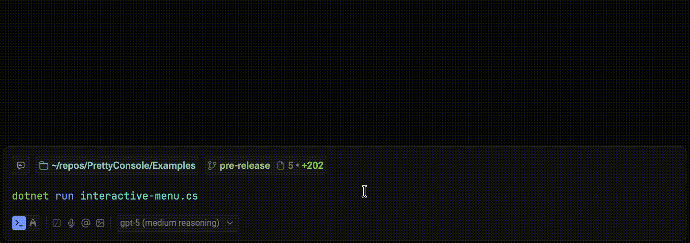
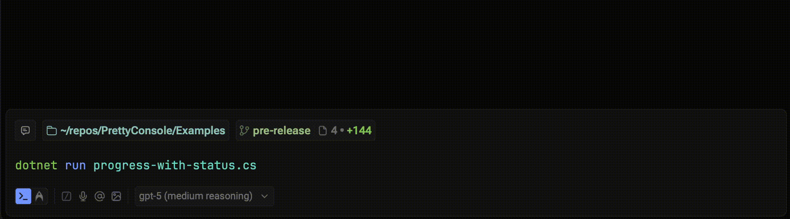
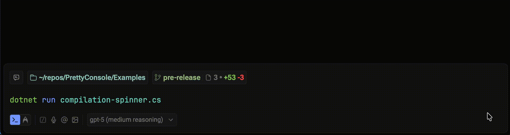
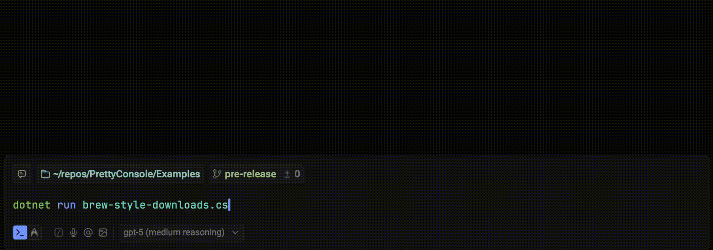

# Examples Gallery

These are simple examples of UIs that can be achieved by properly using the APIs that `PrettyConsole` provides. The examples are written using .NET 10 file-based apps, and can be run with `dotnet run example.cs` (change to the specific "app" name that you want).

- Please keep in mind that colors in the recordings might not appear exactly like their name in code (for example `Color.Green` may look different in the recording). This is not an issue with the package; terminal themes in the recording environment can override how colors are rendered.

## [Interactive menu](interactive-menu.cs)

Three-step wizard that reuses the same screen area via `Console.Overwrite` instead of scrolling, keeping prompts tidy.

## [Progress with status](progress-with-status.cs)

Simple progress bar paired with a live status line underneath—good for downloads or migrations.

## [Compilation spinner](compilation-spinner.cs)

Single-line braille spinner with step labels and elapsed time for a “building…” style readout.

## [Brew‑style downloads](brew-style-downloads.cs)

Shows multiple concurrent package downloads with a braille spinner, aligned byte counters, and overwrite-based repainting on the error pipe.

